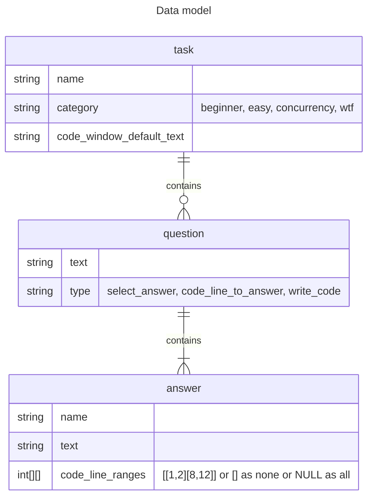
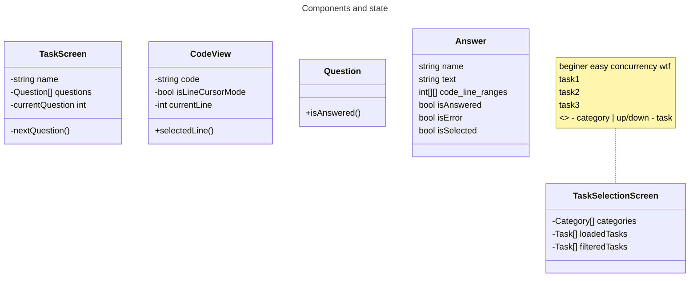

State model:

Features plan:
-[ ] Select task category
  -[ ] Show categories list
  -[ ] Select category
  -[ ] Show task category stats (all - N, completed - X, updated - Y)
-[ ] Select task
  -[ ] Show tasks list
  -[ ] Select task
  -[ ] Show task status (all - N, completed - X, updated - Y)
-[ ] Do task
  -[ ] Show code with code line numbers
  -[ ] Step 1: Select code question answer
    -[ ] Show error state, remove error status when move
    -[ ] Show good state
  -[ ] Next step
    -[ ] Show go to next step
    -[ ] Save current task state
    -[ ] Load saved task state
  -[ ] Step 2: Select code line and question answer variant
    -[ ] Select code line
    -[ ] Select question answer
    -[ ] Show error status 
    -[ ] Show answered status
  -[ ] Keybindings help
  -[ ] Setup layout
    -[ ] Vertical layout
    -[ ] Split screen layout
  -[ ] Step 3: Rewrite code (Ctrl+C, Ctrl+V works)
    -[ ] Show code
    -[ ] Show packages allowed to import
    -[ ] Crtr+C for copy code into buffer
    -[ ] Crtl+V for paste code into editor
    -[ ] Create tmp folder, create files, go run, handle answer
    -[ ] Run tests
    -[ ] Run linter
    -[ ] Show problems list
    -[ ] Code editor inside app
-[ ] Mentoring
  -[ ] Create code review request to mentor
  -[ ] Sync app state mentor <-> mentee