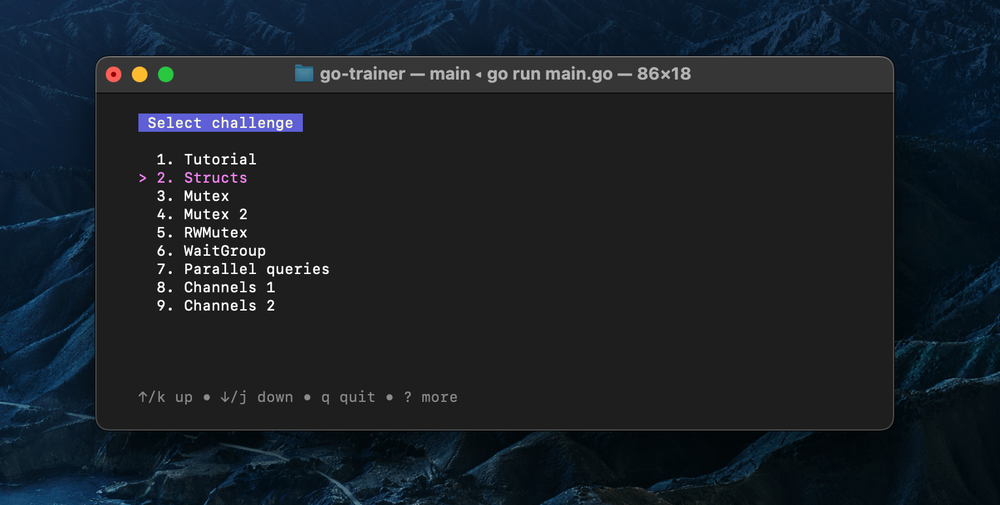
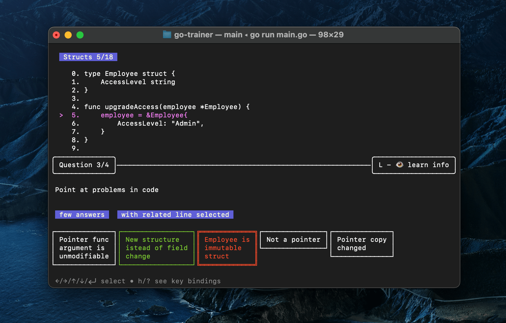
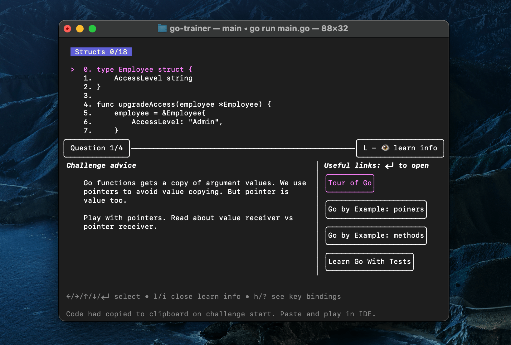

Golang interview questions, learning materials and beautiful quiz terminal app.

* [Why](#why)
* [Features](#features)
  * [Real interview challenges](#8-real-interview-challenges)
  * [Complex questions](#complex-questions)
  * [Learning hints](#learning-hints)
  * [Other](#and-other)
* [Contribution](#support-a-project-community)
* [Installation](#installation-and-usage)
* [Thanks](#thanks)

## Why

I am a mentor. I looked for a way to automate basic help, so I decided to create a single app with interview questions and learning instructions.

Use it to:
- Prepare to GoLang tech interview section
- Study concurrency
- Examine and teach other developers
- Have fun

It will help to improve results if you don't have enough experience in concurrency and interviews.

It complements well with:
- ChatGPT/WizzardLM prompts [for CV editing to XYZ format](https://github.com/f/awesome-chatgpt-prompts#act-as-a-recruiter), [position brainstorming](https://github.com/f/awesome-chatgpt-prompts#act-as-a-talent-coach),
and [interviewer simulation](https://github.com/f/awesome-chatgpt-prompts#act-as-position-interviewer)
- [Interview warmup AI](https://grow.google/certificates/interview-warmup/)

## Features

### 8 real interview challenges

Tutorial and 8 reworked challenges from my experience as an interviewer and candidate.



### Complex questions

It isn't about "program output". Many answers are bounded to code lines.



- No code highlight (yes, it's a feature)
- Guess program output
- Find problems in code
- Offer a fix

### Learning hints

Fix knowledge gaps fast. Jump to question topic in [Tour of Go](https://go.dev/tour), [gobyexample.com](https://gobyexample.com/) and ["Learn go with tests"](https://quii.gitbook.io/learn-go-with-tests/).



### And other

- Challenge code already in you clipboard. You don't have to manually select and copy text.
- Adaptive UI. Interface changes with terminal window size.

## Support a project community

Any contribution is welcome in issues:
- Provide feedback. Report something you don't like in the issues.
- Share a real interview question.
- Share an idea for a new challenge or challenge update.
- Discuss an issue.
- Offer a contribution, and I will guide you through the PR creation process.

## Installation and usage

You should have Go installed

### 1. Install or update

```
go install github.com/rusinikita/trainer@latest
```

### 2. Run

```
trainer
```

### 3. Tutorial

Please, select tutorial as first challenge

## Thanks

Some questions inspired by [this quiz](https://github.com/smallnest/go-concurrent-quiz)
